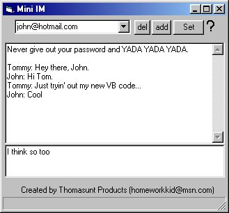



## MSN IM

### Description

This little code simulates an MSN Messenger IM Window. Choose an online user and click Set. Then start talking, right in the window!
 
### More Info
 
Not many programs use the Messenger Type Library. Feel free to learn it from here.

             |
---                |---
**Submitted On**   |2001-11-20 02:21:08
**By**             |[Tommy W\.](https://github.com/Planet-Source-Code/PSCIndex/blob/master/ByAuthor/tommy-w.md)
**Level**          |Beginner
**User Rating**    |3.0 (15 globes from 5 users)
**Compatibility**  |VB 3\.0, VB 4\.0 \(16\-bit\), VB 5\.0, VB 6\.0
**Category**       |[Microsoft Office Apps/VBA](https://github.com/Planet-Source-Code/PSCIndex/blob/master/ByCategory/microsoft-office-apps-vba__1-42.md)
**World**          |[Visual Basic](https://github.com/Planet-Source-Code/PSCIndex/blob/master/ByWorld/visual-basic.md)
**Archive File**   |[MSN\_IM3623911202001\.zip](https://github.com/Planet-Source-Code/tommy-w-msn-im__1-29038/archive/master.zip)

